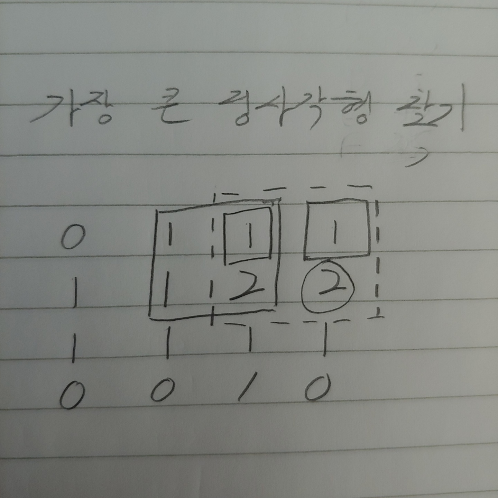

# 가장 큰 정사각형 찾기 (readme 예제)

## 문제 링크
https://programmers.co.kr/learn/courses/30/lessons/12905


## 클루
```python
answer[i][j] = min(answer[i][j-1], answer[i-1][j], answer[i-1][j-1]) + 1
```
정사각형의 넓이를 구하기때문에 왼쪽 오른쪽 뿐만 아니라 왼쪽 귀퉁이도 검사해야 한다. 각각의 정사각형을 겹쳤을때 최소 너비를 가진 정사각형의 너비 + 1만큼이 현재 정점의 정사각형이 된다.


